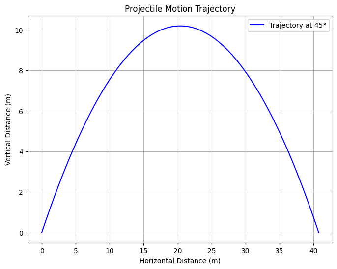
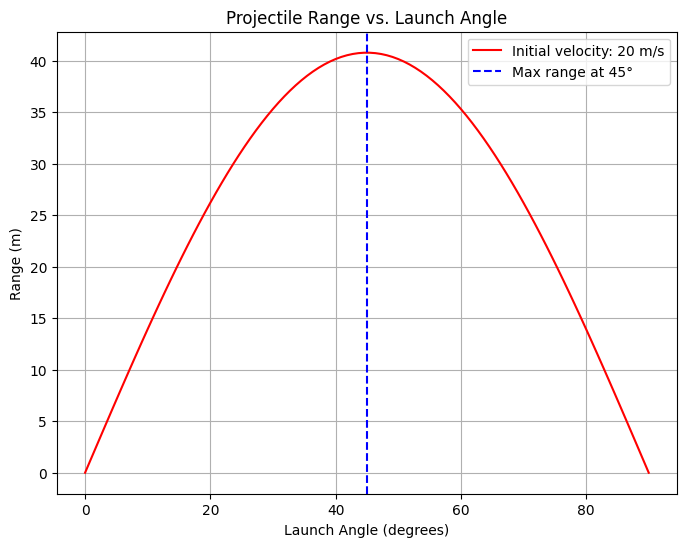

# Problem 1

Here's a detailed explanation of projectile motion, including its governing equations, derivations, and graphical representations.

---

## **Projectile Motion: Theory and Analysis**

### **1. Introduction**
Projectile motion refers to the motion of an object that is launched into the air and moves under the influence of gravity alone, assuming air resistance is negligible. It is a fundamental concept in physics with applications in sports, engineering, and astrophysics.

The motion of the projectile can be broken down into **horizontal (x-direction)** and **vertical (y-direction)** components, each governed by Newton's laws of motion.

---

### **2. Equations of Motion**
#### **2.1 Assumptions**
- The projectile is launched from an initial height \( y_0 = 0 \).
- Air resistance is neglected.
- The acceleration due to gravity (\( g \)) is constant and acts downward.
- The initial velocity \( v_0 \) is at an angle \( \theta \) with the horizontal axis.

#### **2.2 Decomposing Initial Velocity**
The initial velocity \( v_0 \) is split into horizontal and vertical components:
$$
v_{0x} = v_0 \cos\theta
$$
$$
v_{0y} = v_0 \sin\theta
$$

---

### **3. Horizontal Motion**
Since there is no horizontal acceleration (neglecting air resistance), the horizontal displacement \( x \) after time \( t \) is given by:

\[
x = v_{0x} t = v_0 \cos\theta \cdot t
\]

The horizontal velocity remains constant:

\[
v_x = v_0 \cos\theta
\]

---

### **4. Vertical Motion**
The vertical motion is influenced by gravity. Using kinematic equations:

\[
y = v_{0y} t - \frac{1}{2} g t^2
\]

The vertical velocity at time \( t \) is:

\[
v_y = v_{0y} - g t
\]

The projectile reaches its maximum height when \( v_y = 0 \), which occurs at:

\[
t_{\text{max}} = \frac{v_0 \sin\theta}{g}
\]

The maximum height (\( H \)) is given by:

\[
H = \frac{(v_0 \sin\theta)^2}{2g}
\]

---

### **5. Time of Flight**
The total time the projectile spends in the air is found by setting \( y = 0 \) in the vertical displacement equation:

\[
0 = v_0 \sin\theta \cdot t - \frac{1}{2} g t^2
\]

Solving for \( t \):

\[
t = \frac{2 v_0 \sin\theta}{g}
\]

---

### **6. Range of the Projectile**
The range \( R \) is the total horizontal distance traveled before the projectile lands:

\[
R = v_{0x} \cdot t
\]

Substituting \( v_{0x} = v_0 \cos\theta \) and the total time of flight:

\[
R = v_0 \cos\theta \cdot \frac{2 v_0 \sin\theta}{g}
\]

Using the trigonometric identity \( 2\sin\theta\cos\theta = \sin(2\theta) \):

\[
R = \frac{v_0^2 \sin(2\theta)}{g}
\]

The maximum range occurs when \( \theta = 45^\circ \), giving:

\[
R_{\text{max}} = \frac{v_0^2}{g}
\]

---

### **7. Graphical Representation**
Let's visualize how the range varies with launch angle.



#### **Python Code for Simulation**
This script plots:

1. The trajectory of a projectile.
2. The range as a function of launch angle.

```python
import numpy as np
import matplotlib.pyplot as plt

# Constants
g = 9.81  # Gravity (m/s^2)
v0 = 20   # Initial velocity (m/s)
angles = np.linspace(0, 90, 100)  # Launch angles from 0 to 90 degrees

# Function to compute projectile range
def projectile_range(theta, v0, g=9.81):
    theta_rad = np.radians(theta)
    return (v0**2 * np.sin(2 * theta_rad)) / g

# Compute ranges for different angles
ranges = [projectile_range(theta, v0) for theta in angles]

# Trajectory Simulation for a specific angle (e.g., 45°)
theta_trajectory = 45  # Change this to see different angles
t_flight = (2 * v0 * np.sin(np.radians(theta_trajectory))) / g
t = np.linspace(0, t_flight, num=100)
x = v0 * np.cos(np.radians(theta_trajectory)) * t
y = v0 * np.sin(np.radians(theta_trajectory)) * t - 0.5 * g * t**2

# Plot 1: Projectile Trajectory
plt.figure(figsize=(8, 6))
plt.plot(x, y, label=f'Trajectory at {theta_trajectory}°', color='b')
plt.xlabel('Horizontal Distance (m)')
plt.ylabel('Vertical Distance (m)')
plt.title('Projectile Motion Trajectory')
plt.legend()
plt.grid()
plt.show()

# Plot 2: Range vs Angle
plt.figure(figsize=(8, 6))
plt.plot(angles, ranges, label=f'Initial velocity: {v0} m/s', color='r')
plt.axvline(45, linestyle="--", color="b", label="Max range at 45°")
plt.xlabel('Launch Angle (degrees)')
plt.ylabel('Range (m)')
plt.title('Projectile Range vs. Launch Angle')
plt.legend()
plt.grid()
plt.show()

```

#### **Graph Analysis**
1. **Trajectory Plot**: Shows the parabolic path followed by the projectile.
2. **Range vs. Angle**: Demonstrates that the range is maximized at \( 45^\circ \).

---

### **8. Practical Applications**
1. **Sports** – Optimizing the angle for maximum distance in javelin throws, soccer kicks, or basketball shots.
2. **Military** – Calculating projectile trajectories for artillery and missiles.
3. **Engineering** – Predicting motion paths in robotics and mechanical systems.
4. **Astrophysics** – Understanding planetary orbits and space vehicle trajectories.

---

### **9. Extensions**
To make the model more realistic, we can:
- Introduce **air resistance** using drag force proportional to velocity.
- Consider **uneven terrain**, where the landing height differs from the launch height.
- Include **wind effects**, adding a horizontal acceleration component.

---

### **10. Conclusion**
Projectile motion is a fundamental concept with rich mathematical structures and numerous applications. By understanding its governing equations, we can predict and optimize trajectories in various real-world scenarios.

Would you like me to extend this with numerical simulations for air resistance or varying gravitational fields? 🚀