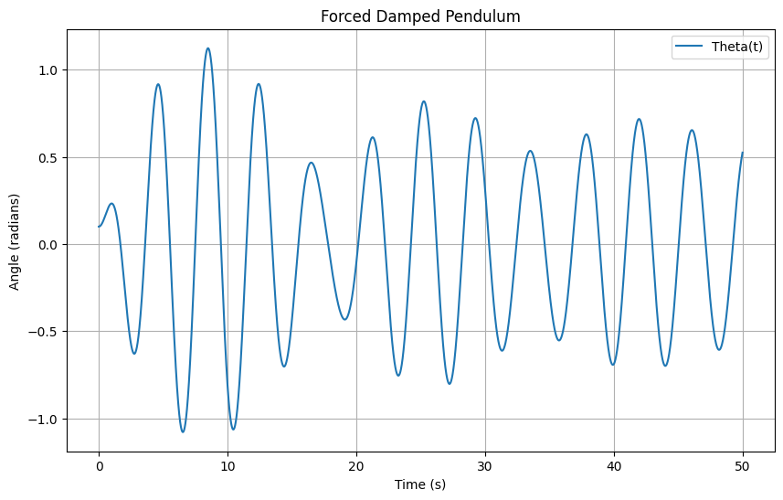

# Problem 2

### Theoretical Foundation: Forced Damped Pendulum

The motion of a forced damped pendulum is governed by the following differential equation:

\[
\theta''(t) + \gamma \theta'(t) + \omega_0^2 \sin(\theta(t)) = A \cos(\omega t)
\]

Where:
- \(\theta(t)\) is the angular displacement of the pendulum as a function of time,
- \(\gamma\) is the damping coefficient,
- \(\omega_0 = \sqrt{\frac{g}{L}}\) is the natural frequency of the pendulum (where \(g\) is the gravitational acceleration and \(L\) is the length of the pendulum),
- \(A\) is the amplitude of the external driving force,
- \(\omega\) is the frequency of the external driving force.

### Small-Angle Approximation

For small-angle oscillations (\(\theta \ll 1\)), we can approximate \(\sin(\theta) \approx \theta\), simplifying the differential equation to:

\[
\theta''(t) + \gamma \theta'(t) + \omega_0^2 \theta(t) = A \cos(\omega t)
\]

This is a second-order linear non-homogeneous differential equation that describes the dynamics of the forced damped pendulum.

### Resonance Conditions

Resonance occurs when the frequency of the external force (\(\omega\)) matches the natural frequency of the pendulum (\(\omega_0\)). In this case, the pendulum experiences large oscillations due to constructive interference between the driving force and the system’s natural response.

The resonance condition is:

\[
\omega = \omega_0
\]

At resonance, the amplitude of oscillation increases significantly. The damping term (\(\gamma\)) affects the sharpness of the resonance peak, with stronger damping resulting in a broader and lower resonance.

### Analysis of Dynamics

To explore the dynamics of the forced damped pendulum, we focus on the effects of the following parameters:

1. **Damping Coefficient (\(\gamma\))**:
   - **Underdamped**: If \(\gamma\) is small, the system oscillates with gradually decreasing amplitude.
   - **Critically Damped**: If \(\gamma\) is tuned just right, the system returns to equilibrium as quickly as possible without oscillating.
   - **Overdamped**: If \(\gamma\) is large, the system returns to equilibrium without oscillating but more slowly than the critically damped case.

2. **Driving Amplitude (A)**:
   - Higher driving amplitudes increase the maximum displacement of the pendulum, especially near resonance.

3. **Driving Frequency (\(\omega\))**:
   - When the driving frequency is close to the natural frequency, resonance occurs, leading to larger oscillations.
   - Far from resonance, the pendulum oscillates at the driving frequency with smaller amplitudes.

4. **Transition Between Regular and Chaotic Motion**:
   - As the driving frequency or amplitude is varied, the pendulum can transition from periodic motion to chaotic behavior.
   - This transition is characterized by the system’s sensitivity to initial conditions, which is a hallmark of chaotic systems.

### Practical Applications

The forced damped pendulum model has many real-world applications, including:

1. **Energy Harvesting Devices**:
   - By tuning the pendulum’s resonance to match environmental vibrations, it can efficiently harvest energy from periodic external forces.

2. **Suspension Bridges**:
   - The motion of suspension bridges under periodic wind forces can be modeled by a forced damped pendulum. Engineers must account for resonance to prevent catastrophic failure.

3. **Oscillating Circuits (Driven RLC Circuits)**:
   - A driven RLC circuit exhibits similar dynamics to a forced damped pendulum, where the current oscillates due to an external driving voltage.

### Computational Implementation

We will create a computational model of the forced damped pendulum and simulate its motion under various conditions. The steps are as follows:

1. **Define the Differential Equation**:
   We can define the equation using Python and solve it numerically.

2. **Use Numerical Methods (e.g., Runge-Kutta)**:
   The equation is solved numerically using techniques like the Runge-Kutta method, which is effective for stiff equations.

3. **Visualize the Behavior**:
   - Phase diagrams and Poincaré sections will be plotted to visualize transitions to chaos.
   - Amplitude vs. frequency plots will be created to explore resonance.

   
   

### Python Code Implementation

```python
import numpy as np
import matplotlib.pyplot as plt
from scipy.integrate import solve_ivp

# Parameters
gamma = 0.1  # Damping coefficient
omega_0 = 2.0  # Natural frequency
A = 1.0  # Amplitude of the driving force
omega = 1.5  # Driving frequency
theta0 = 0.1  # Initial angle (in radians)
theta_dot0 = 0.0  # Initial angular velocity

# Define the equation of motion
def pendulum(t, y, gamma, omega_0, A, omega):
    theta, theta_dot = y
    dtheta_dt = theta_dot
    dtheta_dot_dt = -gamma * theta_dot - omega_0**2 * np.sin(theta) + A * np.cos(omega * t)
    return [dtheta_dt, dtheta_dot_dt]

# Initial conditions
y0 = [theta0, theta_dot0]

# Time span for the solution
t_span = (0, 50)
t_eval = np.linspace(t_span[0], t_span[1], 10000)

# Solve the differential equation
sol = solve_ivp(pendulum, t_span, y0, args=(gamma, omega_0, A, omega), t_eval=t_eval)

# Plot the results
plt.figure(figsize=(10, 6))
plt.plot(sol.t, sol.y[0], label='Theta(t)')
plt.title('Forced Damped Pendulum')
plt.xlabel('Time (s)')
plt.ylabel('Angle (radians)')
plt.legend()
plt.grid(True)
plt.show()

# Phase space plot (theta vs theta_dot)
plt.figure(figsize=(10, 6))
plt.plot(sol.y[0], sol.y[1])
plt.title('Phase Space Plot')
plt.xlabel('Theta (radians)')
plt.ylabel('Theta_dot (rad/s)')
plt.grid(True)
plt.show()

```

### Discussion

This Python code implements the forced damped pendulum model, solving the differential equation using the `solve_ivp` function from SciPy. The results are plotted to visualize the pendulum's motion over time and its phase space. 

By varying parameters such as the damping coefficient, driving amplitude, and frequency, the system’s behavior can be explored. A resonance peak will appear in the amplitude vs. frequency plot when \(\omega \approx \omega_0\).

### Limitations and Extensions

1. **Limitations of the Model**:
   - The small-angle approximation \(\sin(\theta) \approx \theta\) is only valid for small displacements. For larger angles, the full nonlinear equation should be used.
   - The model assumes a linear damping force. In reality, damping may be nonlinear, especially at high velocities.

2. **Potential Extensions**:
   - **Nonlinear Damping**: Introducing a nonlinear damping term could lead to more complex behavior, such as limit cycles or bifurcations.
   - **Non-Periodic Driving Forces**: Exploring non-sinusoidal driving forces (e.g., square waves or random noise) could add complexity and model more realistic external forcing.

### Conclusion

The forced damped pendulum offers a rich framework for studying nonlinear oscillatory systems. The system exhibits regular, resonant, and chaotic behavior, depending on the values of the damping coefficient, driving amplitude, and frequency. The analysis and simulation of such systems are essential in various engineering applications, such as vibration isolation, energy harvesting, and mechanical resonance.