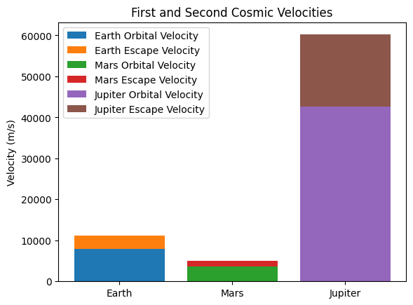

# Problem 2

# Escape Velocities and Cosmic Velocities

## **Motivation**
The concept of escape velocity is crucial for understanding the conditions required to leave a celestial body's gravitational influence. Extending this concept, the first, second, and third cosmic velocities define the thresholds for orbiting, escaping, and leaving a star system. These principles underpin modern space exploration, from launching satellites to interplanetary missions.

## **Definitions of Cosmic Velocities**
### **First Cosmic Velocity (Orbital Velocity)**
The first cosmic velocity \( v_1 \) is the minimum velocity required for an object to maintain a stable circular orbit around a celestial body. It is derived from equating the gravitational force to the required centripetal force:

\[ \frac{G M m}{r^2} = \frac{m v_1^2}{r} \]

Solving for \( v_1 \):

\[ v_1 = \sqrt{\frac{G M}{r}} \]

### **Second Cosmic Velocity (Escape Velocity)**
The second cosmic velocity \( v_2 \) is the minimum velocity required for an object to completely escape the gravitational pull of a celestial body. It is derived using the conservation of energy principle:

\[ \frac{1}{2} m v_2^2 = \frac{G M m}{r} \]

Solving for \( v_2 \):

\[ v_2 = \sqrt{2 \frac{G M}{r}} = \sqrt{2} v_1 \]

### **Third Cosmic Velocity (Solar System Escape Velocity)**
The third cosmic velocity \( v_3 \) is the minimum velocity required for an object to escape the Sun’s gravitational influence from Earth’s orbit. It considers both Earth’s orbital velocity and the escape velocity from the Sun:

\[ v_3 = \sqrt{v_2^2 + v_{Earth-Orbit}^2} \]

where \( v_{Earth-Orbit} \) is Earth’s orbital velocity around the Sun.

## **Mathematical Analysis and Parameters Affecting Cosmic Velocities**
- **Mass (M):** Larger celestial bodies require higher escape velocities.
- **Radius (r):** Smaller planets have lower escape velocities due to reduced gravity.
- **Atmospheric Drag:** Can influence actual required launch velocities.

## **Computational Calculation and Visualization**
We compute these velocities for Earth, Mars, and Jupiter using Python.



```python
import numpy as np
import matplotlib.pyplot as plt
from scipy.constants import G

# Define planetary parameters (mass in kg, radius in meters)
planets = {
    "Earth": {"M": 5.972e24, "R": 6.371e6},
    "Mars": {"M": 6.417e23, "R": 3.389e6},
    "Jupiter": {"M": 1.898e27, "R": 6.9911e7},
}

def compute_velocities(M, R):
    v1 = np.sqrt(G * M / R)
    v2 = np.sqrt(2) * v1
    return v1, v2

# Compute velocities
velocities = {planet: compute_velocities(data["M"], data["R"]) for planet, data in planets.items()}

# Plot results
fig, ax = plt.subplots()
labels = []
for planet, (v1, v2) in velocities.items():
    ax.bar(planet, v1, label=f"{planet} Orbital Velocity")
    ax.bar(planet, v2 - v1, bottom=v1, label=f"{planet} Escape Velocity")

ax.set_ylabel("Velocity (m/s)")
ax.set_title("First and Second Cosmic Velocities")
ax.legend()
plt.show()
```

## **Applications in Space Exploration**
- **Launching Satellites:** Requires first cosmic velocity to stay in orbit.
- **Interplanetary Travel:** Requires second cosmic velocity to leave planetary gravity.
- **Interstellar Missions:** Requires third cosmic velocity to leave the solar system.

## **Conclusion**
Escape and cosmic velocities define key thresholds in space exploration. Their calculations help in designing spacecraft trajectories and fuel-efficient launches, making them fundamental to modern astrophysics and astronautics.

