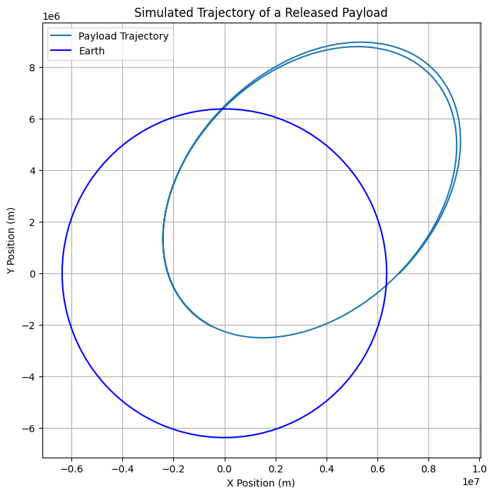
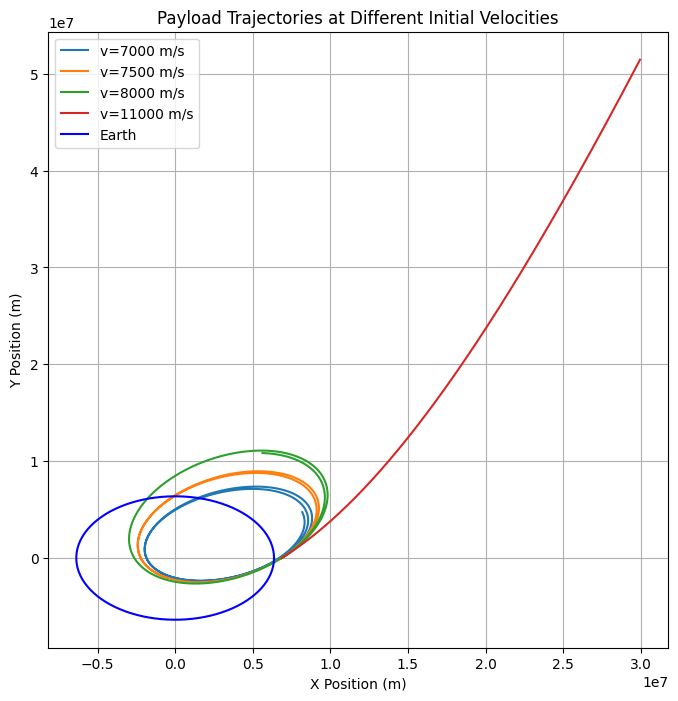
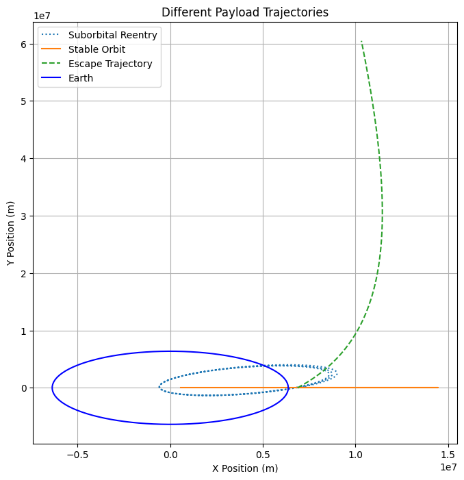

# Problem 3

# Trajectories of a Freely Released Payload Near Earth

## **Motivation**
When an object is released from a moving rocket near Earth, its trajectory depends on initial conditions and gravitational forces. This scenario presents a rich problem, blending principles of orbital mechanics and numerical methods. Understanding the potential trajectories is vital for space missions, such as deploying payloads or returning objects to Earth.

## **Types of Possible Trajectories**
A payload released from a moving spacecraft can follow different trajectories based on its initial velocity relative to Earth:
1. **Elliptical Orbit:** If the payload's velocity is below Earth's escape velocity but high enough to avoid immediate reentry, it follows an elliptical path.
2. **Parabolic Trajectory:** If the velocity equals escape velocity, the object follows a parabolic trajectory, never returning but not bound to another orbit.
3. **Hyperbolic Escape:** If the velocity exceeds escape velocity, the payload moves along a hyperbolic trajectory, permanently leaving Earth's gravity.
4. **Suborbital Reentry:** If the velocity is too low, the payload follows a downward arc and reenters Earth's atmosphere.

## **Mathematical Foundation**
Newton’s Second Law and Newton’s Law of Universal Gravitation govern the motion:

\[ F = m a \]
\[ F = \frac{G M m}{r^2} \]

From these, we derive the equation of motion:

\[ \ddot{r} = -\frac{G M}{r^2} \]

where:
- \( G \) is the gravitational constant,
- \( M \) is the mass of Earth,
- \( r \) is the radial distance from Earth's center,
- \( \ddot{r} \) is the acceleration due to gravity.

The velocity required for different trajectories is:
- **Orbital velocity**: \( v_1 = \sqrt{\frac{G M}{r}} \)
- **Escape velocity**: \( v_2 = \sqrt{2} v_1 \)

## **Numerical Simulations of Payload Trajectory**
Using Python, we solve the equations of motion numerically using the Runge-Kutta method.

### **1. Basic Trajectory Simulation**



```python
import numpy as np
import matplotlib.pyplot as plt
from scipy.integrate import solve_ivp
from scipy.constants import G

# Define Earth parameters
M_earth = 5.972e24  # kg
R_earth = 6.371e6  # m

# Define gravitational acceleration function
def gravity(t, y):
    x, vx, y, vy = y
    r = np.sqrt(x**2 + y**2)
    ax = -G * M_earth * x / r**3
    ay = -G * M_earth * y / r**3
    return [vx, ax, vy, ay]

# Initial conditions (altitude, velocity, direction)
altitude = 500e3  # 500 km above Earth
v_initial = 7500  # Initial velocity in m/s
angle = np.radians(45)  # Release angle
x0, y0 = R_earth + altitude, 0
vx0, vy0 = v_initial * np.cos(angle), v_initial * np.sin(angle)

# Solve trajectory
T_final = 10000  # Simulation time
sol = solve_ivp(gravity, [0, T_final], [x0, vx0, y0, vy0], t_eval=np.linspace(0, T_final, 1000))

# Extract solution
x, y = sol.y[0], sol.y[2]

# Plot results
plt.figure(figsize=(8, 8))
plt.plot(x, y, label="Payload Trajectory")
theta = np.linspace(0, 2*np.pi, 100)
plt.plot(R_earth*np.cos(theta), R_earth*np.sin(theta), label="Earth", color='blue')
plt.xlabel("X Position (m)")
plt.ylabel("Y Position (m)")
plt.legend()
plt.title("Simulated Trajectory of a Released Payload")
plt.grid()
plt.show()
```

### **2. Simulating Different Initial Velocities**



```python
def simulate_trajectory(v_initial, angle):
    vx0, vy0 = v_initial * np.cos(angle), v_initial * np.sin(angle)
    sol = solve_ivp(gravity, [0, T_final], [x0, vx0, y0, vy0], t_eval=np.linspace(0, T_final, 1000))
    return sol.y[0], sol.y[2]

plt.figure(figsize=(8, 8))

for v in [7000, 7500, 8000, 11000]:
    x, y = simulate_trajectory(v, np.radians(45))
    plt.plot(x, y, label=f"v={v} m/s")

plt.plot(R_earth*np.cos(theta), R_earth*np.sin(theta), label="Earth", color='blue')
plt.xlabel("X Position (m)")
plt.ylabel("Y Position (m)")
plt.legend()
plt.title("Payload Trajectories at Different Initial Velocities")
plt.grid()
plt.show()
```

### **3. Visualizing Escape and Reentry Scenarios**



```python
plt.figure(figsize=(8, 8))

# Suborbital Reentry
x, y = simulate_trajectory(6000, np.radians(30))
plt.plot(x, y, label="Suborbital Reentry", linestyle='dotted')

# Orbital Motion
x, y = simulate_trajectory(7800, np.radians(0))
plt.plot(x, y, label="Stable Orbit", linestyle='solid')

# Escape Trajectory
x, y = simulate_trajectory(11200, np.radians(60))
plt.plot(x, y, label="Escape Trajectory", linestyle='dashed')

plt.plot(R_earth*np.cos(theta), R_earth*np.sin(theta), label="Earth", color='blue')
plt.xlabel("X Position (m)")
plt.ylabel("Y Position (m)")
plt.legend()
plt.title("Different Payload Trajectories")
plt.grid()
plt.show()
```

## **Applications in Space Exploration**
- **Satellite Deployment:** Determines proper release velocities for stable orbits.
- **Reentry Missions:** Helps plan controlled payload returns to Earth.
- **Interplanetary Travel:** Analyzing how payloads can be transferred between celestial bodies.

## **Conclusion**
The trajectory of a freely released payload depends on its initial velocity and position. Numerical simulations help predict outcomes, ensuring successful space missions.

