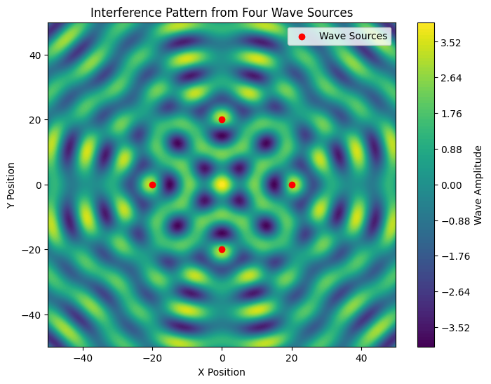

# Problem 1

# **Interference Patterns on a Water Surface**

## **Motivation**
Interference occurs when waves from different sources overlap, creating unique patterns. On a water surface, this can be observed when ripples from different points meet, forming interference patterns. These patterns demonstrate how waves combine, either reinforcing or canceling each other.

Studying these patterns helps us understand wave behavior and key concepts such as phase relationships and multi-source interactions. This task offers an engaging way to explore wave physics and its real-world applications in areas such as acoustics, optics, and fluid dynamics.

## **Problem Statement**
Analyze the interference patterns formed on the water surface due to the superposition of waves emitted from point sources placed at the vertices of a chosen regular polygon.

## **Mathematical Model**
A circular wave on the water surface, emanating from a point source located at \((x_0, y_0)\), can be described by:

\[
\psi_i(x, y, t) = A \cos(k r_i - \omega t + \phi_0)
\]

where:
- \( \psi_i(x, y, t) \) is the displacement of the water surface at point \((x, y)\) and time \( t \),
- \( A \) is the wave amplitude,
- \( k \) is the wave number, related to the wavelength \( \lambda \) by \( k = \frac{2\pi}{\lambda} \),
- \( \omega \) is the angular frequency, related to the frequency \( f \) by \( \omega = 2\pi f \),
- \( r_i \) is the distance from the \( i \)-th source to the point \((x, y)\),
- \( \phi_0 \) is the initial phase.

Using the principle of superposition, the total displacement at any point on the water surface is:

\[
\Psi(x, y, t) = \sum_{i=1}^{N} \psi_i(x, y, t)
\]

where \( N \) is the number of sources positioned at the vertices of the chosen regular polygon.

## **Simulation of Interference Patterns**




```python
import numpy as np
import matplotlib.pyplot as plt
import matplotlib.animation as animation
from mpl_toolkits.mplot3d import Axes3D

# Define wave parameters
A = 1       # Amplitude
wavelength = 10  # Wavelength (arbitrary units)
k = 2 * np.pi / wavelength  # Wave number
f = 1       # Frequency (arbitrary units)
w = 2 * np.pi * f  # Angular frequency

# Grid for simulation
x = np.linspace(-50, 50, 400)
y = np.linspace(-50, 50, 400)
X, Y = np.meshgrid(x, y)

# Define function to compute interference pattern
def interference_pattern(sources, t=0, phase_shifts=None):
    Psi = np.zeros_like(X)
    if phase_shifts is None:
        phase_shifts = [0] * len(sources)
    for i, (x0, y0) in enumerate(sources):
        r = np.sqrt((X - x0)**2 + (Y - y0)**2)
        Psi += A * np.cos(k * r - w * t + phase_shifts[i])
    return Psi

# Define sources at vertices of different polygons
def generate_polygon(n_sides, radius=20):
    return [(radius * np.cos(2 * np.pi * i / n_sides), radius * np.sin(2 * np.pi * i / n_sides)) for i in range(n_sides)]

# Example: Interference from a square configuration
polygon_vertices = generate_polygon(4)  # Change number for different polygons
Psi = interference_pattern(polygon_vertices)

# Plot the interference pattern
plt.figure(figsize=(8, 6))
plt.contourf(X, Y, Psi, levels=100, cmap='viridis')
plt.colorbar(label='Wave Amplitude')
plt.scatter(*zip(*polygon_vertices), color='red', marker='o', label='Wave Sources')
plt.xlabel("X Position")
plt.ylabel("Y Position")
plt.title("Interference Pattern from Four Wave Sources")
plt.legend()
plt.show()

# 3D Surface Plot
fig = plt.figure(figsize=(10, 7))
ax = fig.add_subplot(111, projection='3d')
ax.plot_surface(X, Y, Psi, cmap='coolwarm', edgecolor='none')
ax.set_title("3D Surface Plot of Interference")
ax.set_xlabel("X Position")
ax.set_ylabel("Y Position")
ax.set_zlabel("Wave Amplitude")
plt.show()
```

## **Analysis of Interference Patterns**
- **Constructive Interference:** Bright regions indicate where waves reinforce each other, forming high amplitude waves.
- **Destructive Interference:** Dark regions show cancellation where the crest of one wave meets the trough of another.
- **Wavefronts:** The contour lines illustrate the wavefronts as they propagate outward from each source.
- **Phase Difference Effects:** By introducing phase shifts in the sources, different interference patterns can emerge.

## **Applications of Wave Interference**
1. **Acoustics:** Understanding sound wave interference helps in noise cancellation and speaker placement in auditoriums.
2. **Optics:** Similar principles apply in light interference, such as in double-slit experiments and anti-reflective coatings.
3. **Water Engineering:** Interference patterns assist in analyzing wave behavior in harbors and coastal structures.

## **Conclusion**
By placing wave sources at the vertices of a regular polygon, we observe rich interference patterns formed by their superposition. These simulations provide insights into wave behavior, demonstrating fundamental principles of physics in an intuitive and visual manner.

