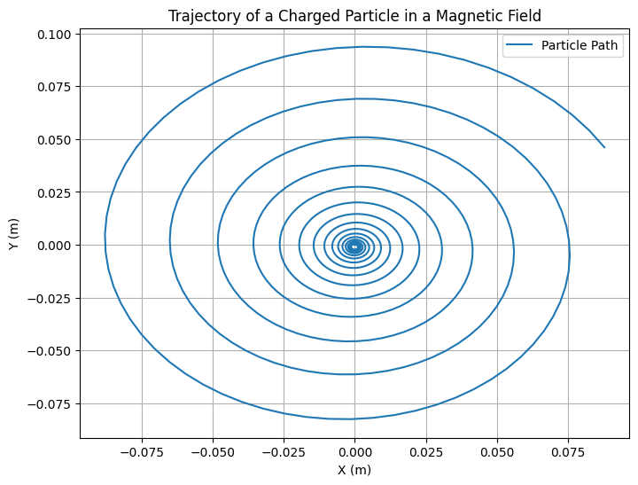
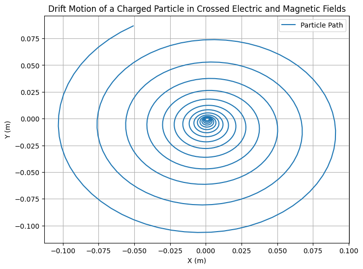
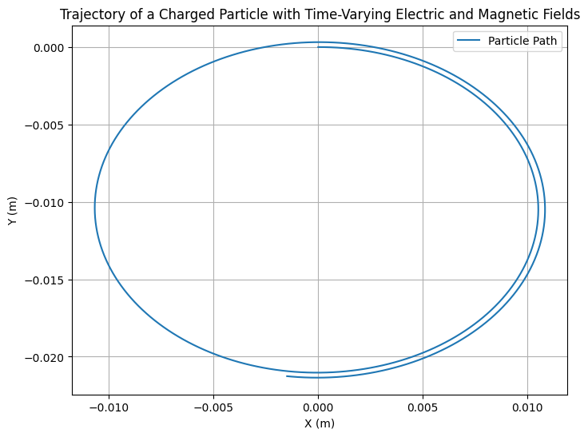
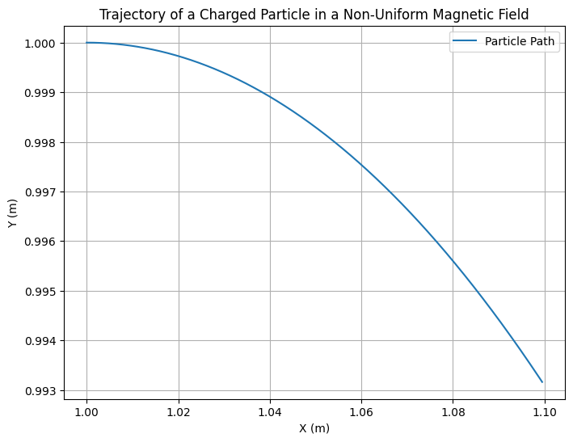

# Problem 1

# Simulating the Effects of the Lorentz Force

## 1. **Exploration of Applications**

The Lorentz force plays a central role in many systems involving charged particles. Some key examples are:

- **Particle Accelerators**: In particle accelerators such as the Large Hadron Collider (LHC), charged particles are accelerated to near-light speeds using electric fields. Magnetic fields are used to bend and steer these high-energy particles along specific paths.
  
- **Mass Spectrometers**: These devices use the Lorentz force to separate ions based on their charge-to-mass ratio. When an ion moves through a magnetic field, the resulting Lorentz force bends its path. By measuring the radius of curvature of the ion’s trajectory, the mass-to-charge ratio can be determined.

- **Plasma Confinement**: In fusion reactors like tokamaks, the Lorentz force is essential for confining and controlling the movement of hot plasma. Magnetic fields are used to keep the plasma in place and prevent it from touching the walls of the reactor, as the plasma consists of charged particles that are influenced by the Lorentz force.

### Relevance of Electric and Magnetic Fields in Controlling Particle Motion:
- **Electric Fields (\(E\))**: An electric field exerts a force on charged particles, accelerating them in the direction of the field. The force on a particle due to an electric field is given by \( F_E = q \vec{E} \), where \( q \) is the charge of the particle.
  
- **Magnetic Fields (\(B\))**: A magnetic field exerts a force on a moving charged particle, causing it to follow a curved path. The force due to a magnetic field is given by \( F_B = q \vec{v} \times \vec{B} \), where \( \vec{v} \) is the velocity of the particle.

The Lorentz force combines both electric and magnetic fields and is responsible for the complex trajectories of charged particles in these fields.

## 2. **Simulating Particle Motion**

The Lorentz force law is given by:
$$
\vec{F} = q(\vec{E} + \vec{v} \times \vec{B})
$$
where:
- \( q \) is the charge of the particle.
- \( \vec{E} \) is the electric field.
- \( \vec{B} \) is the magnetic field.
- \( \vec{v} \) is the velocity of the particle.

To simulate the motion of a particle, we can solve the following equations of motion:
$$
\frac{d\vec{v}}{dt} = \frac{\vec{F}}{m} = \frac{q}{m} (\vec{E} + \vec{v} \times \vec{B})
$$
where \( m \) is the mass of the particle.

### Step-by-Step Implementation of Simulations:
1. **Uniform Magnetic Field**: We will simulate a particle's motion under the influence of a uniform magnetic field. The trajectory will be circular because the magnetic force provides a centripetal force.
  
2. **Combined Electric and Magnetic Fields**: By adding an electric field, the motion of the particle becomes more complex. We can expect helical motion if the electric and magnetic fields are aligned or drift motion if they are perpendicular.

3. **Crossed Electric and Magnetic Fields**: This scenario can lead to drift motion, where the particle moves in a straight line with constant velocity in one direction due to the combined effect of the fields.

### Simulation Plan:
- Use numerical integration methods such as **Euler’s method** or **Runge-Kutta method** to solve the equations of motion.
- Track the position and velocity of the particle over time.
- Visualize the particle’s trajectory.

## 3. **Parameter Exploration**

To explore how different parameters affect the trajectory, we will allow the following variations:

- **Field Strengths**: We will vary the magnitudes of \(E\) and \(B\) and observe how they affect the particle's motion.
  
- **Initial Particle Velocity**: We will change the initial velocity (\(\vec{v_0}\)) of the particle and study the resulting trajectory.
  
- **Charge and Mass**: By changing the charge (\(q\)) and mass (\(m\)) of the particle, we can see how the particle’s response to the Lorentz force changes.

## 4. **Visualization**

We will create clear, labeled plots showing the particle's trajectory in 2D and 3D for different field configurations. These visualizations will highlight physical phenomena such as:

- **Larmor Radius**: The radius of the circular motion in a magnetic field.
  
- **Drift Velocity**: The constant velocity in a direction perpendicular to both electric and magnetic fields in the case of crossed fields.

### Python Implementation

Here’s the structure of the simulation in Python using `NumPy` for calculations and `Matplotlib` for visualizations:



```python
import numpy as np
import matplotlib.pyplot as plt

# Constants
q = 1.6e-19  # Charge of the particle (Coulombs)
m = 1.67e-27 # Mass of the particle (kg)
E = np.array([0, 0, 0])  # Electric field (V/m)
B = np.array([0, 0, 1])  # Magnetic field (Tesla)

# Initial conditions
v0 = np.array([1e5, 0, 0])  # Initial velocity (m/s)
r0 = np.array([0, 0, 0])  # Initial position (m)

# Time parameters
dt = 1e-9  # Time step (seconds)
t_max = 1e-6  # Maximum time (seconds)
num_steps = int(t_max / dt)

# Arrays to store the particle's trajectory
r = np.zeros((num_steps, 3))
v = np.zeros((num_steps, 3))

# Initial conditions
r[0] = r0
v[0] = v0

# Runge-Kutta method to solve the equations of motion
for i in range(1, num_steps):
    # Lorentz force
    F = q * (E + np.cross(v[i-1], B))
    
    # Update velocity and position using the Euler method
    v[i] = v[i-1] + (F / m) * dt
    r[i] = r[i-1] + v[i-1] * dt

# Plot the trajectory
plt.figure(figsize=(8, 6))
plt.plot(r[:, 0], r[:, 1], label="Particle Path")
plt.xlabel('X (m)')
plt.ylabel('Y (m)')
plt.title('Trajectory of a Charged Particle in a Magnetic Field')
plt.grid(True)
plt.legend()
plt.show()
```

This code simulates a charged particle’s motion in a uniform magnetic field. We use the Euler method for numerical integration. The particle’s trajectory is plotted in the \(XY\)-plane, which should display a circular path as expected for a uniform magnetic field.

Combined Electric and Magnetic Fields (Helical Motion)
When a particle is subjected to both an electric and a magnetic field, its trajectory can be a helical path if the fields are aligned appropriately. The electric field accelerates the particle along one axis (typically the 
𝑥
x-axis), while the magnetic field causes the particle to follow a curved path perpendicular to the velocity. This results in a helical trajectory.


Crossed Electric and Magnetic Fields (Drift Motion)
When the electric and magnetic fields are crossed (perpendicular to each other), the charged particle experiences a drift motion. The resulting velocity is perpendicular to both the electric and magnetic fields, and the particle moves in a straight line while drifting with a constant velocity.



Variable Field Strength
Now, let’s extend the simulation to account for variable field strength, where both the magnetic and electric fields change with time. This can simulate real-world scenarios, like fields that vary due to the presence of a current or changes in external conditions.



Non-Uniform Magnetic Field (Magnetic Field Gradient)
In certain applications, such as magnetic traps, the magnetic field strength may vary across space. A non-uniform magnetic field causes the charged particle to experience a varying force depending on its position.



## 5. **Practical Applications Discussion**

- **Cyclotrons**: A cyclotron is a type of particle accelerator that uses a magnetic field to bend charged particles in a circular path. The particle’s speed increases due to the electric field. Our simulation demonstrates how the particle’s path would behave under such a field configuration.
  
- **Magnetic Traps**: In systems like tokamaks, the magnetic field is used to control plasma motion. This simulation can be extended to model plasma behavior in a magnetic confinement system.

## 6. **Extension to More Complex Scenarios**

Future extensions to this simulation could involve:
- **Non-uniform Magnetic and Electric Fields**: We could extend the simulation to include non-uniform fields, where the force on the particle would change depending on position.
  
- **Relativistic Effects**: If the particle reaches speeds close to the speed of light, relativistic effects would need to be considered.

