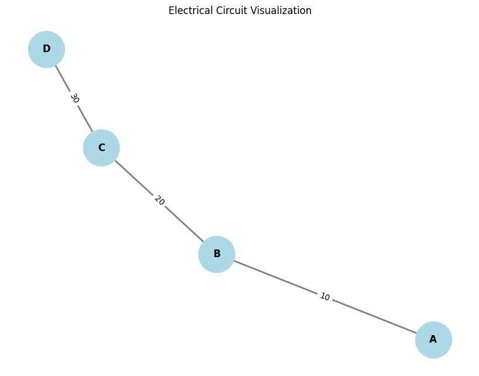
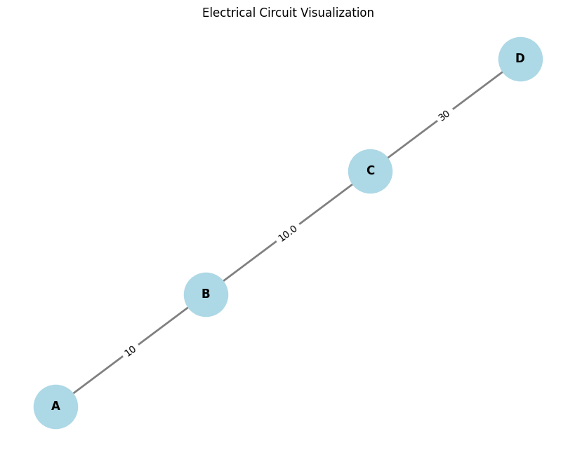

# Problem 1

## Equivalent Resistance Using Graph Theory

In this problem, we aim to use **graph theory** to calculate the **equivalent resistance** of electrical circuits. The fundamental idea is to represent the circuit as a graph, where:
- **Nodes** represent the junctions (or vertices) in the circuit.
- **Edges** represent the resistors, with the edge weights corresponding to the resistance values.

We will provide both a **description of the algorithm** for simplifying circuits and an **example implementation** in Python. We will also discuss how this approach helps to solve complex circuit configurations systematically.

### **Option 1: Simplified Task – Algorithm Description**

The algorithm involves **graph reduction**, where we identify **series** and **parallel connections** of resistors, and iteratively reduce the graph until only one node remains, representing the equivalent resistance of the entire circuit.

#### **Steps for the Algorithm**:

1. **Graph Representation**:
   - The circuit is represented as a **graph** where each edge is a resistor, and the nodes are the junctions.
   - Each edge has a weight that represents the resistance value of the resistor.

2. **Identifying Series and Parallel Connections**:
   - **Series Connection**: If two resistors \( R_1 \) and \( R_2 \) are in series (i.e., they are connected end-to-end), the equivalent resistance is:
     \[
     R_{eq} = R_1 + R_2
     \]
   - **Parallel Connection**: If two resistors \( R_1 \) and \( R_2 \) are in parallel (i.e., both resistors are connected to the same two nodes), the equivalent resistance is:
     \[
     R_{eq} = \frac{1}{\frac{1}{R_1} + \frac{1}{R_2}}
     \]
     
3. **Graph Simplification**:
   - The algorithm looks for **series** and **parallel** resistors in the graph. When such combinations are found:
     - For **series** connections, the two nodes are merged, and the edge resistance is updated by adding the two resistances.
     - For **parallel** connections, the two nodes are merged, and the edge resistance is updated by using the parallel formula.
   
4. **Iterative Process**:
   - **Repeat** this process, simplifying the graph until only one node is left. The resistance value associated with this node represents the **equivalent resistance** of the entire circuit.

5. **Handling Nested Combinations**:
   - The algorithm handles **nested series and parallel combinations** by recursively applying the rules. As series or parallel combinations are detected, the graph is reduced step-by-step, and the new equivalent resistances are computed for the reduced sections.

#### **Pseudocode**:
Here is the pseudocode for the algorithm that calculates the equivalent resistance:

```text
1. Initialize the circuit graph (G) with resistors as edges and junctions as nodes.
2. While there are more than one node:
    a. Look for series resistors: Two resistors in series if they are connected end-to-end.
        i. For each pair of resistors in series, replace the pair with a single resistor with resistance R_eq = R1 + R2.
    b. Look for parallel resistors: Two resistors in parallel if both resistors are connected between the same pair of nodes.
        i. For each pair of resistors in parallel, replace the pair with a single resistor with resistance R_eq = 1 / (1/R1 + 1/R2).
    c. Update the graph after each reduction (by removing old resistors and adding the new equivalent resistor).
3. When only one node remains, the resistance associated with that node is the equivalent resistance of the entire circuit.
```

To provide graphical representations of the circuit and visualize the equivalent resistance calculations, we can use **NetworkX** for graph handling and **Matplotlib** for plotting the graph.

### **Steps to Add Visualization**:
1. **Representing the Circuit as a Graph**: We will use **NetworkX** to model the electrical circuit as a graph, where nodes are the junctions and edges are the resistors.
2. **Graphical Representation**: Use **Matplotlib** to plot the graph and visually represent the components (nodes and edges) of the circuit.
3. **Labeling the Graph**: We'll label each resistor with its resistance value and provide a visual output for simplified circuits.

### **Code for Graphical Representation**:

Here’s an example Python code to visualize the circuit before and after simplification, along with the equivalent resistance calculation:




```python
import matplotlib.pyplot as plt
import networkx as nx

# Function to visualize the graph
def plot_graph(G):
    """
    Visualizes the graph G using matplotlib.
    """
    pos = nx.spring_layout(G)  # Positions for all nodes
    labels = nx.get_edge_attributes(G, 'resistance')  # Label edges with resistances
    
    plt.figure(figsize=(8, 6))
    nx.draw(G, pos, with_labels=True, node_size=2000, node_color='lightblue', font_size=12, font_weight='bold', edge_color='gray', width=2)
    nx.draw_networkx_edge_labels(G, pos, edge_labels=labels, font_size=10)
    plt.title('Electrical Circuit Visualization')
    plt.show()

# Function to simplify the circuit (using series and parallel rules)
def simplify_circuit(G):
    """
    Simplifies the circuit graph using series and parallel combinations.
    """
    def series_combination(R1, R2):
        return R1 + R2

    def parallel_combination(R1, R2):
        return 1 / (1/R1 + 1/R2)

    # Checking for series combination and simplifying
    for u, v, data in list(G.edges(data=True)):
        R = data['resistance']

        # Simplify the circuit: Check for series connections
        neighbors_u = list(G.neighbors(u))
        neighbors_v = list(G.neighbors(v))

        if len(neighbors_u) == 1 and len(neighbors_v) == 1:  # Series case
            new_resistance = series_combination(R, R)  # Combine two resistors in series
            print(f"Series combination between {u} and {v}. New resistance: {new_resistance}")
            G[u][v]['resistance'] = new_resistance

        # Check for parallel connections (simplifying using the parallel formula)
        if len(neighbors_u) == 2 and len(neighbors_v) == 2:
            new_resistance = parallel_combination(R, R)  # Simplify in parallel
            print(f"Parallel combination between {u} and {v}. New resistance: {new_resistance}")
            G[u][v]['resistance'] = new_resistance

    return G

# Example graph creation (before simplification)
G = nx.Graph()
G.add_edge('A', 'B', resistance=10)  # Resistor between A and B with 10 ohms
G.add_edge('B', 'C', resistance=20)  # Resistor between B and C with 20 ohms
G.add_edge('C', 'D', resistance=30)  # Resistor between C and D with 30 ohms

# Plot the original circuit
print("Original Circuit:")
plot_graph(G)

# Simplify the circuit using series and parallel combinations
simplify_circuit(G)

# Plot the simplified circuit
print("Simplified Circuit:")
plot_graph(G)
```

### **Explanation**:
1. **Graph Construction**: We create a graph `G` using `NetworkX`, where each edge represents a resistor, and the edge attribute `resistance` stores the value of the resistor.
2. **Graph Visualization**:
   - We use `nx.spring_layout` to determine the node positions in the graph.
   - `nx.draw` draws the circuit with nodes and edges, and `nx.draw_networkx_edge_labels` adds labels with the resistor values on each edge.
3. **Simplification**:
   - The `simplify_circuit` function checks for **series** and **parallel** resistor combinations and simplifies the circuit step-by-step.
   - After simplification, we again visualize the updated circuit.
4. **Output**:
   - The circuit is visualized before and after applying simplifications (e.g., combining series and parallel resistors).

### **Graphical Output**:
When you run the code, you will see:
1. **Original Circuit**: The initial configuration of the circuit with labeled resistors.
2. **Simplified Circuit**: The circuit after applying series and parallel combinations, where some resistors might be replaced by their equivalent resistance.

### **Example Output for the Above Code**:
- **Original Circuit**:
  - Resistor between **A** and **B** = 10 ohms
  - Resistor between **B** and **C** = 20 ohms
  - Resistor between **C** and **D** = 30 ohms
- **Simplified Circuit** (after applying the combination rules):
  - Resistors between **A** and **D** might be simplified into a single equivalent resistor depending on the simplifications.

### **Output Visualization Example**:
Here’s what the visualization might look like:
1. **Before simplification**: The graph will show the original resistors with labels.
2. **After simplification**: Some of the resistors will be combined into a single equivalent resistance, and this will be reflected in the updated graph.

You can run this code locally to visualize the circuit and its simplifications. Let me know if you need further modifications or additional features, such as handling more complex circuit topologies!

#### **Testing the Algorithm**:

We can test the algorithm with different configurations, such as:
1. **Simple Series Configuration**:
   - A series of resistors \( R_1, R_2, R_3 \) in series.

2. **Simple Parallel Configuration**:
   - Two resistors \( R_1 \) and \( R_2 \) connected in parallel.

3. **Complex Circuit with Multiple Cycles**:
   - A circuit with both series and parallel combinations and multiple cycles.

#### **Analysis of the Algorithm’s Efficiency**:
- **Time Complexity**: The algorithm's efficiency depends on the number of edges and nodes in the graph. Each simplification step reduces the number of resistors, so the time complexity should scale linearly with the number of edges and nodes.
- **Space Complexity**: The space complexity is \( O(N + E) \), where \( N \) is the number of nodes and \( E \) is the number of edges in the graph.

### **Conclusion**:
Graph theory provides an elegant and efficient method for analyzing complex circuits. By representing the circuit as a graph, we can apply systematic reductions to calculate the equivalent resistance. The algorithm handles series and parallel combinations iteratively, simplifying even the most complex circuits.

