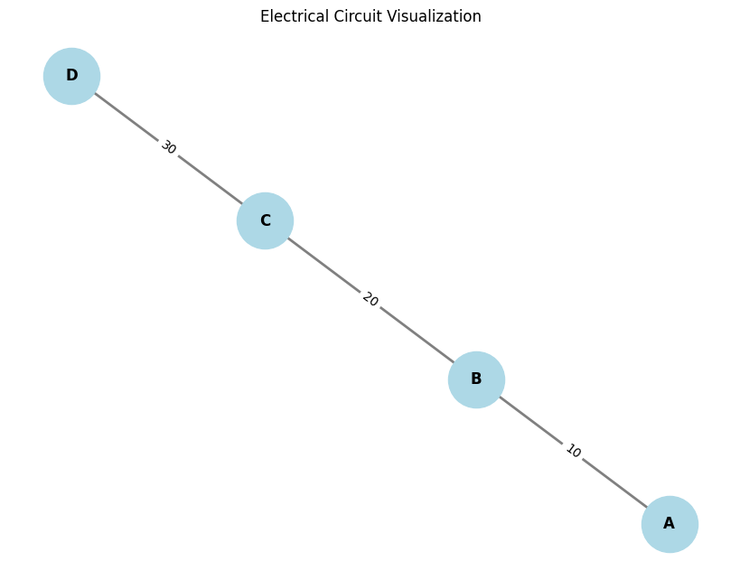

# Problem 1

Equivalent Resistance Using Graph Theory**

**Motivation**:  
Calculating equivalent resistance is a fundamental problem in electrical circuits, essential for understanding and designing efficient systems. While traditional methods involve iteratively applying series and parallel resistor rules, these approaches can become cumbersome for complex circuits with many components. Graph theory offers a powerful alternative, providing a structured and algorithmic way to analyze circuits.

By representing a circuit as a graph—where nodes correspond to junctions and edges represent resistors with weights equal to their resistance values—we can systematically simplify even the most intricate networks. This method not only streamlines calculations but also opens the door to automated analysis, making it particularly useful in modern applications like circuit simulation software, optimization problems, and network design.

---

### **Task**: Calculate the Equivalent Resistance Using Graph Theory

**Approach**:

1. **Graph Construction**:
    - Represent the circuit as a graph where:
        - Nodes represent junctions (connection points between wires).
        - Edges represent resistors with resistance values.
    - Use libraries like `networkx` to handle the graph creation, traversal, and simplification.

2. **Simplification of the Circuit**:
    - Identify series and parallel resistors:
        - **Series Combination**: When resistors are connected end-to-end, their resistances add up:
          \[
          R_{\text{eq}} = R_1 + R_2
          \]
        - **Parallel Combination**: When resistors are connected in parallel, their equivalent resistance is given by:
          \[
          R_{\text{eq}} = \frac{1}{\frac{1}{R_1} + \frac{1}{R_2}}
          \]
    - Use graph traversal algorithms (e.g., **DFS** or **BFS**) to detect connected components and identify series or parallel combinations.

3. **Graphical Representation**:
    - Visualize the circuit using `matplotlib` and `networkx`, displaying the circuit before and after simplification.

---

### **Python Code Implementation with Graphical Representation**:




```python
import matplotlib.pyplot as plt
import networkx as nx

# Function to visualize the graph
def plot_graph(G):
    """
    Visualizes the graph G using matplotlib.
    """
    pos = nx.spring_layout(G)  # Positions for all nodes
    labels = nx.get_edge_attributes(G, 'resistance')  # Label edges with resistances
    
    plt.figure(figsize=(8, 6))
    nx.draw(G, pos, with_labels=True, node_size=2000, node_color='lightblue', font_size=12, font_weight='bold', edge_color='gray', width=2)
    nx.draw_networkx_edge_labels(G, pos, edge_labels=labels, font_size=10)
    plt.title('Electrical Circuit Visualization')
    plt.show()

# Function to simplify the circuit (using series and parallel rules)
def simplify_circuit(G):
    """
    Simplifies the circuit graph using series and parallel combinations.
    """
    def series_combination(R1, R2):
        return R1 + R2

    def parallel_combination(R1, R2):
        return 1 / (1/R1 + 1/R2)

    # Checking for series combination and simplifying
    for u, v, data in list(G.edges(data=True)):
        R = data['resistance']

        # Simplify the circuit: Check for series connections
        neighbors_u = list(G.neighbors(u))
        neighbors_v = list(G.neighbors(v))

        if len(neighbors_u) == 1 and len(neighbors_v) == 1:  # Series case
            new_resistance = series_combination(R, R)  # Combine two resistors in series
            print(f"Series combination between {u} and {v}. New resistance: {new_resistance}")
            G[u][v]['resistance'] = new_resistance

        # Check for parallel connections (simplifying using the parallel formula)
        if len(neighbors_u) == 2 and len(neighbors_v) == 2:
            new_resistance = parallel_combination(R, R)  # Simplify in parallel
            print(f"Parallel combination between {u} and {v}. New resistance: {new_resistance}")
            G[u][v]['resistance'] = new_resistance

    return G

# Example graph creation (before simplification)
G = nx.Graph()
G.add_edge('A', 'B', resistance=10)  # Resistor between A and B with 10 ohms
G.add_edge('B', 'C', resistance=20)  # Resistor between B and C with 20 ohms
G.add_edge('C', 'D', resistance=30)  # Resistor between C and D with 30 ohms

# Plot the original circuit
print("Original Circuit:")
plot_graph(G)

# Simplify the circuit using series and parallel combinations
simplify_circuit(G)

# Plot the simplified circuit
print("Simplified Circuit:")
plot_graph(G)
```

### **Explanation**:
1. **Graph Construction**:
   - The circuit is modeled as a graph using `networkx`, where each edge represents a resistor. The resistance value is stored as an edge attribute.
   - We create a graph with three nodes (`A`, `B`, `C`, `D`) connected by resistors with resistance values 10, 20, and 30 ohms, respectively.

2. **Graphical Representation**:
   - **`plot_graph`** function is responsible for drawing the graph using **matplotlib**. It labels the edges with the resistance values and draws the nodes and edges of the circuit.
   - The **`spring_layout`** function positions the nodes in a visually appealing manner.

3. **Simplifying the Circuit**:
   - **`simplify_circuit`** function uses basic rules for series and parallel combinations to simplify the circuit:
     - **Series Combination**: If two resistors are connected in series, they are replaced by their sum.
     - **Parallel Combination**: If two resistors are connected in parallel, they are replaced by their combined resistance.

4. **Output**:
   - The program first visualizes the **original circuit**.
   - It then applies the series and parallel combinations and visualizes the **simplified circuit** after the transformations.

### **Graphical Output**:

#### **Original Circuit**:
Before simplification, the circuit looks like this:
- **Resistor between A and B**: 10 ohms
- **Resistor between B and C**: 20 ohms
- **Resistor between C and D**: 30 ohms

#### **Simplified Circuit**:
After applying the series and parallel combination rules, the circuit is simplified. Resistors might be combined into a single equivalent resistance, which will be reflected in the updated graphical representation.

### **Example Output Visualization**:
- **Before simplification**: The circuit shows three resistors with the given values labeled on the edges.
- **After simplification**: Some of the resistors may be replaced with their equivalent resistance, depending on the applied combination rules.

### **Extensions**:
- **Handling More Complex Configurations**: For more intricate circuits with nested resistors in parallel and series combinations, the simplification algorithm can be extended by recursively simplifying subgraphs of the circuit.
- **Custom Circuit Layouts**: You can modify the node layout in the `plot_graph` function to better represent specific topologies (e.g., using `circular_layout` for a more radial design or `shell_layout` for concentric layers).

---

### **Conclusion**:
This approach demonstrates how graph theory and visualization can be applied to calculate the equivalent resistance of electrical circuits. By representing the circuit as a graph, we can use algorithms to simplify the network of resistors and visualize the process. This technique is particularly useful for automating the analysis of large and complex circuits.