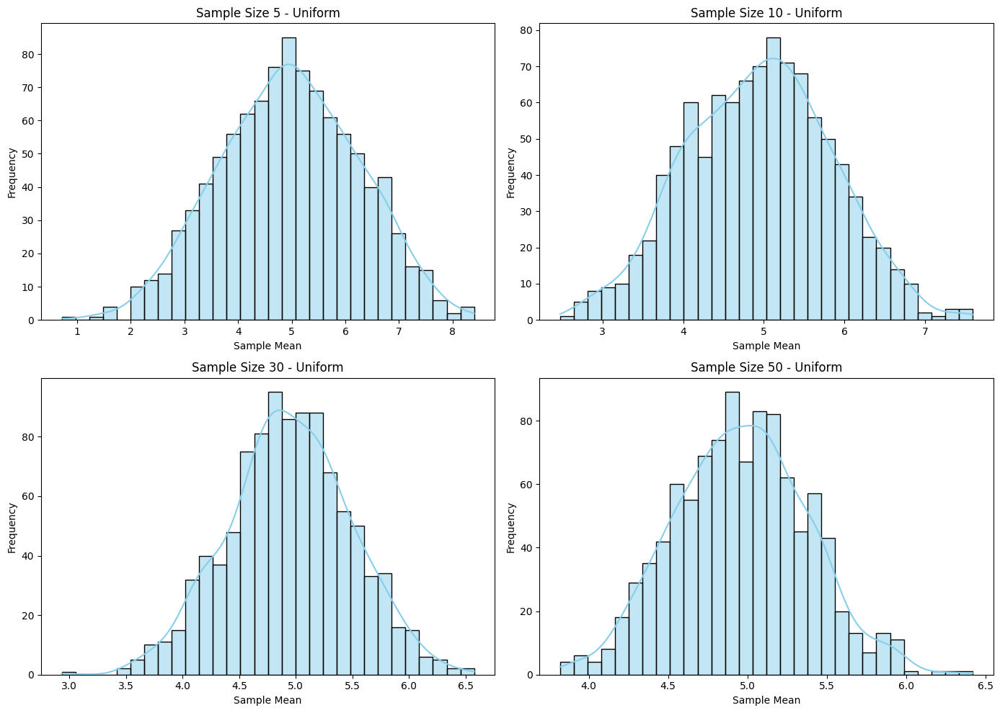
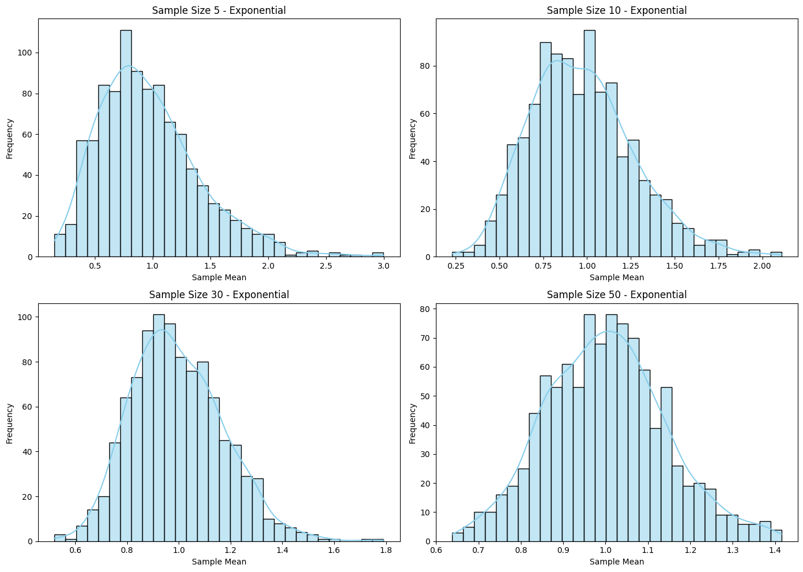
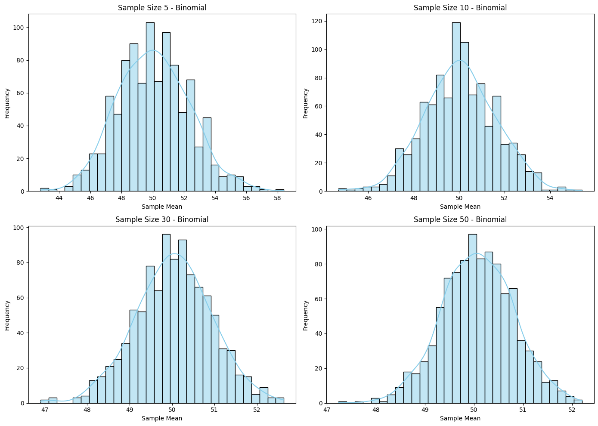

# Problem 1

### **Problem: Exploring the Central Limit Theorem (CLT) through Simulations**

#### **Motivation**:
The **Central Limit Theorem (CLT)** is a fundamental concept in statistics. It states that, regardless of the population’s distribution, the sampling distribution of the sample mean will approach a **normal distribution** as the sample size increases. This holds true as long as the population has a finite variance.

This task uses simulations to help visualize the CLT, which can be challenging to grasp without practical examples. Through computational experiments, students can see how the sample means converge toward a normal distribution, regardless of the underlying population's distribution.

---

### **Task Overview**:
1. **Simulating Sampling Distributions**:
   - Select several types of population distributions (e.g., Uniform, Exponential, Binomial) and generate large datasets to represent each.
2. **Sampling and Visualization**:
   - Randomly sample data from each population and calculate the sample mean for different sample sizes.
   - Repeat the sampling process to create a distribution of sample means for each sample size.
   - Plot histograms to observe the distribution of sample means.
3. **Parameter Exploration**:
   - Investigate how the original distribution shape and sample size influence the convergence to a normal distribution.
4. **Practical Applications**:
   - Discuss the importance of the CLT in real-world scenarios such as **population estimation**, **quality control**, and **financial predictions**.

---

### **Python Code Implementation**:

The following Python script simulates the CLT using three types of distributions: **Uniform**, **Exponential**, and **Binomial**. We will generate large datasets for each population, sample data from them, calculate sample means for various sample sizes, and visualize the convergence to a normal distribution.





#### **Step-by-Step Code**:

```python
import numpy as np
import matplotlib.pyplot as plt
import seaborn as sns

# Set random seed for reproducibility
np.random.seed(42)

# Function to simulate sampling distribution
def simulate_clt(population_func, population_params, sample_sizes, num_samples=1000):
    """
    Simulate the Central Limit Theorem by generating sample means from different sample sizes.
    
    :param population_func: Function that generates population data (e.g., np.random.uniform).
    :param population_params: Parameters for the population function (e.g., (low, high) for uniform).
    :param sample_sizes: List of sample sizes to experiment with.
    :param num_samples: Number of samples to draw for each sample size.
    :return: Dictionary with sample sizes as keys and corresponding sample means as values.
    """
    sample_means = {}
    
    # Generate the full population data
    population = population_func(*population_params, size=10000)
    
    for size in sample_sizes:
        means = []
        for _ in range(num_samples):
            sample = np.random.choice(population, size=size, replace=False)
            means.append(np.mean(sample))
        sample_means[size] = means
        
    return sample_means

# Function to plot sampling distributions for various sample sizes
def plot_sampling_distribution(sample_means, population_name):
    """
    Plot histograms of the sample means for different sample sizes to visualize the CLT.
    
    :param sample_means: Dictionary with sample means for different sample sizes.
    :param population_name: Name of the population distribution for title.
    """
    plt.figure(figsize=(14, 10))
    
    for i, (size, means) in enumerate(sample_means.items()):
        plt.subplot(2, 2, i+1)
        sns.histplot(means, kde=True, bins=30, color='skyblue')
        plt.title(f'Sample Size {size} - {population_name}')
        plt.xlabel('Sample Mean')
        plt.ylabel('Frequency')
    
    plt.tight_layout()
    plt.show()

# Population distributions and parameters
distributions = {
    "Uniform": (np.random.uniform, (0, 10)),  # Uniform distribution between 0 and 10
    "Exponential": (np.random.exponential, (1,)),  # Exponential distribution with scale 1
    "Binomial": (np.random.binomial, (100, 0.5)),  # Binomial distribution with n=100, p=0.5
}

# Sample sizes to test
sample_sizes = [5, 10, 30, 50]

# Simulate and plot results for each population distribution
for name, (population_func, population_params) in distributions.items():
    print(f"Simulating for {name} distribution...")
    sample_means = simulate_clt(population_func, population_params, sample_sizes)
    plot_sampling_distribution(sample_means, name)
```

---

### **Explanation of Code**:

1. **Population Function**:  
   The `simulate_clt` function takes in the population generation function (such as `np.random.uniform`) and the parameters for that distribution (e.g., range for the uniform distribution, rate for the exponential distribution, etc.).
   
2. **Sampling Process**:  
   For each sample size (e.g., 5, 10, 30, 50), the script randomly selects data points from the population, computes the sample mean, and repeats the process for a large number of samples (e.g., 1000). This generates a distribution of sample means for each sample size.

3. **Visualization**:  
   - The `plot_sampling_distribution` function generates histograms of the sample means for each sample size and displays them side-by-side using **Seaborn** and **Matplotlib**.
   - The histograms are overlaid with kernel density estimates (KDE) to better visualize the shape of the distributions.
   
4. **Distributions Explored**:
   - **Uniform Distribution**: A uniform distribution between 0 and 10.
   - **Exponential Distribution**: An exponential distribution with a rate of 1.
   - **Binomial Distribution**: A binomial distribution with 100 trials and a success probability of 0.5.

5. **Sample Sizes**:  
   The script tests different sample sizes, such as 5, 10, 30, and 50, to observe how the sampling distribution converges to normality as the sample size increases.

---

### **Expected Results**:

When you run this simulation:

- **For small sample sizes (e.g., 5)**, you will notice that the sampling distribution of the sample means might appear skewed or irregular, particularly for non-normal populations (like the binomial or exponential distributions).
- **As the sample size increases (e.g., 50)**, the distribution of sample means will start to approximate a normal distribution, even for populations that are not normally distributed. This is the **Central Limit Theorem** in action.
  
### **Interpretation of Results**:

- **Uniform Distribution**: The sampling distribution will converge to a normal distribution as the sample size increases.
- **Exponential Distribution**: Although the original population is highly skewed, the sampling distribution of the sample mean will become normal as the sample size increases.
- **Binomial Distribution**: Even though the binomial distribution is discrete, the sampling distribution of the sample mean will tend towards normality with a sufficiently large sample size.

---

### **Discussion of Practical Applications**:

1. **Estimating Population Parameters**:  
   The CLT allows us to estimate population parameters, such as the population mean, by taking sample means. As the sample size increases, the sample mean becomes more accurate and approximates the true population mean.

2. **Quality Control**:  
   In manufacturing, the CLT is used to monitor production processes. By sampling products at regular intervals and calculating the mean, quality control teams can detect deviations from expected norms.

3. **Financial Models**:  
   In finance, the CLT can be applied to model stock returns and predict future outcomes. Even if the underlying data is not normally distributed (e.g., stock returns), the sampling distribution of the mean can still be treated as normal for large sample sizes.

---

### **Conclusion**:

The **Central Limit Theorem** is a powerful concept that helps bridge the gap between real-world data and statistical theory. By simulating various population distributions and observing how the sampling distribution of the mean behaves as the sample size increases, we gain a deeper understanding of the significance of the CLT in practical applications. This exercise also emphasizes the importance of sample size in achieving reliable estimates and understanding statistical processes.

