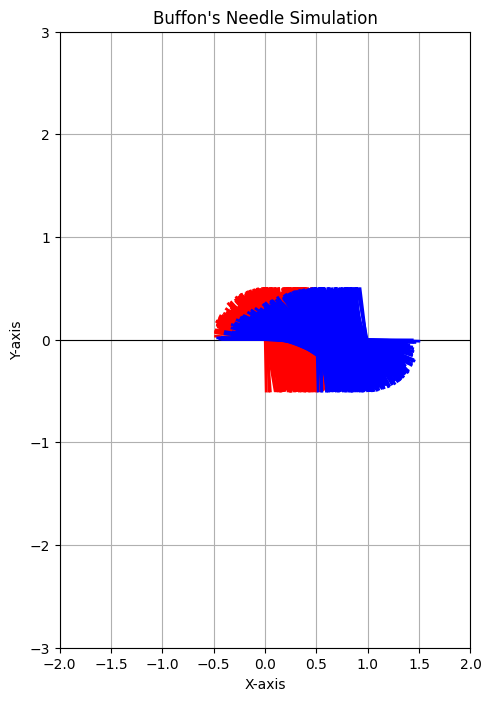

# Problem 2

### Problem 2: Estimating Pi Using Monte Carlo Methods

Monte Carlo simulations offer an intuitive way to estimate values through random sampling. This problem involves estimating the value of \( \pi \) using two different Monte Carlo methods: one based on a circle inscribed in a square, and the other based on Buffon's Needle.

---

## **Part 1: Estimating \( \pi \) Using a Circle**

### **1. Theoretical Foundation**

The idea behind using a circle inscribed in a square to estimate \( \pi \) comes from the geometric probability. 

- A unit circle is a circle with radius \( r = 1 \), and it is inscribed within a square of side length 2, which means that the square has corners at \( (-1, -1) \), \( (1, -1) \), \( (1, 1) \), and \( (-1, 1) \).
- The ratio of the area of the circle to the area of the square is \( \frac{\pi r^2}{(2r)^2} = \frac{\pi}{4} \), because the area of the unit circle is \( \pi \), and the area of the square is \( 4 \) (side length 2).
  
Thus, the ratio of points inside the circle to the total number of points within the square approaches \( \frac{\pi}{4} \) as the number of points increases. This can be expressed as:

\[
\pi \approx 4 \times \left(\frac{\text{Number of points inside the circle}}{\text{Total number of points}}\right)
\]

### **2. Simulation**

In this approach:
- Generate random points in a 2D square with coordinates \( (x, y) \) where \( -1 \leq x \leq 1 \) and \( -1 \leq y \leq 1 \).
- Check if the point lies inside the unit circle by using the equation \( x^2 + y^2 \leq 1 \).
- Count the number of points inside the circle and use the ratio to estimate \( \pi \).


### **Python Code: Circle-based Monte Carlo Method**

```python
import numpy as np
import matplotlib.pyplot as plt

# Function to estimate Pi using the Circle-based Monte Carlo Method
def estimate_pi_circle(num_points):
    # Generate random points within the square [-1, 1] x [-1, 1]
    x = np.random.uniform(-1, 1, num_points)
    y = np.random.uniform(-1, 1, num_points)
    
    # Check how many points lie inside the unit circle (x^2 + y^2 <= 1)
    inside_circle = np.sum(x**2 + y**2 <= 1)
    
    # Estimate Pi based on the ratio of points inside the circle
    pi_estimate = 4 * inside_circle / num_points
    return pi_estimate, x, y, inside_circle

# Visualization function to show the points inside and outside the circle
def plot_circle_simulation(x, y, inside_circle):
    plt.figure(figsize=(6,6))
    plt.scatter(x[inside_circle == 1], y[inside_circle == 1], color='blue', label='Inside Circle')
    plt.scatter(x[inside_circle == 0], y[inside_circle == 0], color='red', label='Outside Circle')
    plt.gca().set_aspect('equal', adjustable='box')
    plt.xlim([-1, 1])
    plt.ylim([-1, 1])
    plt.title("Monte Carlo Simulation for Estimating Pi")
    plt.legend()
    plt.xlabel("x-axis")
    plt.ylabel("y-axis")
    plt.grid(True)
    plt.show()

# Simulate the estimation of Pi with 10,000 points
num_points = 10000
pi_estimate, x, y, inside_circle = estimate_pi_circle(num_points)

print(f"Estimated Pi: {pi_estimate}")
plot_circle_simulation(x, y, inside_circle)
```

### **Explanation of the Code:**
- **estimate_pi_circle** generates `num_points` random points in the 2D square and checks if each point lies inside the unit circle. It then estimates \( \pi \) using the formula derived earlier.
- **plot_circle_simulation** visualizes the points, showing those inside the circle in blue and those outside in red.

### **3. Analysis**
- As the number of points increases, the estimated value of \( \pi \) should converge to the true value of \( \pi \).
- This simulation provides a graphical representation of random points and their relationship to the circle.
- **Convergence**: The estimate improves with more points, as the ratio approaches the true value of \( \pi \) (around 3.14159).

---

## **Part 2: Estimating \( \pi \) Using Buffon’s Needle**

### **1. Theoretical Foundation**

Buffon’s Needle problem is a famous probability problem that involves dropping a needle of length \( L \) onto a plane with parallel lines spaced a distance \( d \) apart. The probability \( P \) that the needle will cross a line is given by:

\[
P = \frac{2L}{\pi d}
\]

For the case where \( L = d \), this simplifies to:

\[
P = \frac{2}{\pi}
\]

Thus, by counting the number of needle drops that cross a line, we can estimate \( \pi \) using the following formula:

\[
\pi \approx \frac{2 \times \text{Total Drops}}{\text{Drops Crossing Line}}
\]

### **2. Simulation**

Simulate dropping a needle of fixed length on a plane with parallel lines and calculate how often it crosses a line. Count the number of drops and crossings to estimate \( \pi \).

### **Python Code: Buffon’s Needle Simulation**

```python
import numpy as np

# Function to simulate Buffon's Needle problem and estimate Pi
def estimate_pi_buffon(needle_length, line_distance, num_drops):
    crossings = 0
    
    # Simulate needle drops
    for _ in range(num_drops):
        # Randomly select angle (theta) and distance from the closest line (x)
        theta = np.random.uniform(0, np.pi / 2)  # Angle between 0 and pi/2
        x = np.random.uniform(0, line_distance / 2)  # Distance from the line (0 to d/2)
        
        # Check if the needle crosses a line
        if x <= (needle_length / 2) * np.sin(theta):
            crossings += 1
    
    # Estimate Pi using the formula
    pi_estimate = (2 * needle_length * num_drops) / (crossings * line_distance)
    return pi_estimate

# Simulate the estimation of Pi using Buffon's Needle with 10000 drops
needle_length = 1  # Length of the needle
line_distance = 2  # Distance between lines
num_drops = 10000  # Number of needle drops

pi_estimate_buffon = estimate_pi_buffon(needle_length, line_distance, num_drops)
print(f"Estimated Pi using Buffon's Needle: {pi_estimate_buffon}")
```

### **Explanation of the Code:**
- **estimate_pi_buffon** simulates dropping the needle \( num\_drops \) times. For each drop, it randomly generates the angle \( \theta \) and the distance \( x \) from the nearest line. If the needle crosses a line, we count it as a crossing.
- The formula for estimating \( \pi \) is then applied based on the number of crossings.

### **3. Analysis**
- Similar to the circle-based method, as the number of drops increases, the estimate of \( \pi \) will converge to the true value.
- This simulation relies on geometric probability, and while it converges slowly compared to the circle-based method, it is another interesting and historically significant way to estimate \( \pi \).

For graphical representations of the **Buffon's Needle method**, we need to visually show the positions of the needles, particularly the cases where the needle crosses a line and where it doesn't. Here’s how we can do that:

### **Steps to Visualize Buffon’s Needle:**
1. Randomly drop the needle on the plane.
2. Calculate its position and orientation.
3. Determine if it crosses a line or not.
4. Plot the needle and mark the crossing needles in a different color.



### **Python Code with Graphical Representation:**

```python
import numpy as np
import matplotlib.pyplot as plt

# Function to simulate Buffon's Needle problem and estimate Pi
def estimate_pi_buffon(needle_length, line_distance, num_drops):
    crossings = 0
    crossing_lines = []
    no_crossing_lines = []
    
    # Simulate needle drops
    for _ in range(num_drops):
        # Randomly select angle (theta) and distance from the closest line (x)
        theta = np.random.uniform(0, np.pi / 2)  # Angle between 0 and pi/2
        x = np.random.uniform(0, line_distance / 2)  # Distance from the line (0 to d/2)
        
        # Check if the needle crosses a line
        if x <= (needle_length / 2) * np.sin(theta):
            crossings += 1
            crossing_lines.append((x, theta))  # Store crossing lines for plotting
        else:
            no_crossing_lines.append((x, theta))  # Store non-crossing lines for plotting
    
    # Estimate Pi using the formula
    pi_estimate = (2 * needle_length * num_drops) / (crossings * line_distance)
    return pi_estimate, crossing_lines, no_crossing_lines

# Function to plot the graphical representation of the needle drops
def plot_buffons_needle(crossing_lines, no_crossing_lines, needle_length, line_distance):
    plt.figure(figsize=(8, 8))
    ax = plt.gca()
    
    # Draw the lines (spacing between the parallel lines)
    for i in range(-int(needle_length // 2), int(needle_length // 2) + 1):
        ax.axhline(y=i * line_distance, color='black', linewidth=0.8, linestyle='-')

    # Plot the needles that cross the lines
    for (x, theta) in crossing_lines:
        x_start = x - (needle_length / 2) * np.cos(theta)
        x_end = x + (needle_length / 2) * np.cos(theta)
        y_start = (needle_length / 2) * np.sin(theta)
        y_end = -y_start
        ax.plot([x_start, x_end], [y_start, y_end], color='red', linewidth=2)
    
    # Plot the needles that do not cross the lines
    for (x, theta) in no_crossing_lines:
        x_start = x - (needle_length / 2) * np.cos(theta)
        x_end = x + (needle_length / 2) * np.cos(theta)
        y_start = (needle_length / 2) * np.sin(theta)
        y_end = -y_start
        ax.plot([x_start, x_end], [y_start, y_end], color='blue', linewidth=2)

    # Set limits and labels
    ax.set_aspect('equal', 'box')
    plt.xlim(-line_distance, line_distance)
    plt.ylim(-line_distance * 1.5, line_distance * 1.5)
    plt.title("Buffon's Needle Simulation")
    plt.xlabel("X-axis")
    plt.ylabel("Y-axis")
    plt.grid(True)
    plt.show()

# Simulate the estimation of Pi using Buffon's Needle with graphical representation
needle_length = 1  # Length of the needle
line_distance = 2  # Distance between lines
num_drops = 1000  # Number of needle drops

pi_estimate_buffon, crossing_lines, no_crossing_lines = estimate_pi_buffon(needle_length, line_distance, num_drops)
print(f"Estimated Pi using Buffon's Needle: {pi_estimate_buffon}")

# Plot the graphical representation
plot_buffons_needle(crossing_lines, no_crossing_lines, needle_length, line_distance)
```

### **Explanation of Graphical Code:**
1. **`estimate_pi_buffon`**:
   - In addition to counting the crossings, we store the needle's position and angle for both crossing and non-crossing needles.
   
2. **`plot_buffons_needle`**:
   - This function uses `matplotlib` to plot the simulation of the needle drops:
     - We draw the parallel lines first, spaced according to `line_distance`.
     - We then plot the needles that cross a line in **red** and those that do not cross in **blue**.
   
3. **Visualization**:
   - The plot will show a visual representation of the needles and lines, with red lines indicating the cases where the needle crosses the parallel lines and blue lines where it doesn't.
   - The grid and axis limits are adjusted for a clear view of the entire simulation.

### **Expected Output:**
- A plot will show the lines and needles. The red needles indicate where the needle crosses a line, while the blue needles do not cross a line.
- The `print` statement will output the estimated value of \( \pi \) based on the number of needle drops.

### **How to Run:**
- Just run the script and you should see the graphical output after the simulation, along with the printed estimated value of \( \pi \).

This should provide a visually engaging way to understand how Buffon’s Needle works and how it can be used to estimate \( \pi \).

---

## **Comparison and Conclusion**

### **1. Accuracy and Computational Efficiency:**
- **Circle-based method**: Converges relatively faster to the true value of \( \pi \). The convergence is more direct since it directly uses geometric probability based on the circle.
- **Buffon’s Needle**: Converges much slower compared to the circle method due to the nature of the problem. It requires a significant number of needle drops to produce an accurate estimate.

### **2. Graphical Outputs:**
- **Circle-based method**: Shows a clear visual distinction between points inside and outside the circle, which is engaging and intuitive.
- **Buffon’s Needle**: The visualization can show the needle positions relative to the lines, which is useful for understanding the mechanics of the problem.

---

### **Deliverables:**
1. **Markdown document** explaining both methods and their formulas.
2. **Python scripts** for the Monte Carlo circle-based method and Buffon’s Needle method.
3. **Graphical outputs**: Plots showing random points for the circle-based method and needle positions for Buffon’s Needle.
4. **Analysis**: Convergence graphs or tables comparing the accuracy of both methods.

This task offers hands-on experience with Monte Carlo methods and geometric probability, reinforcing the power of randomness in computational simulations.