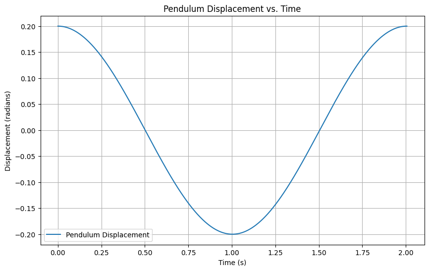
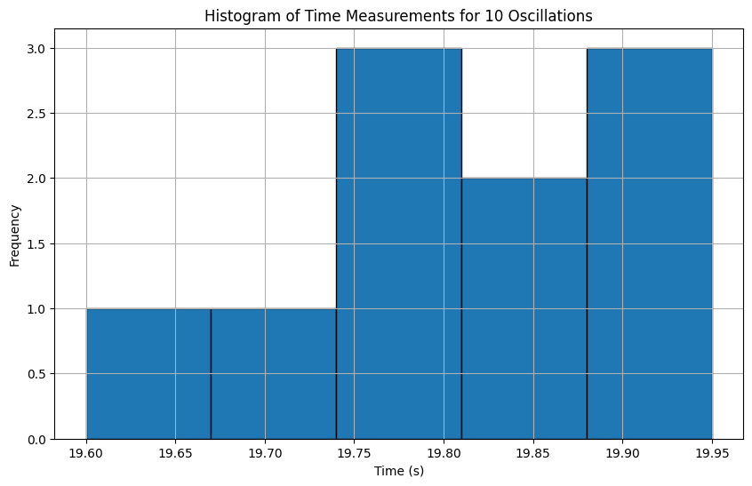
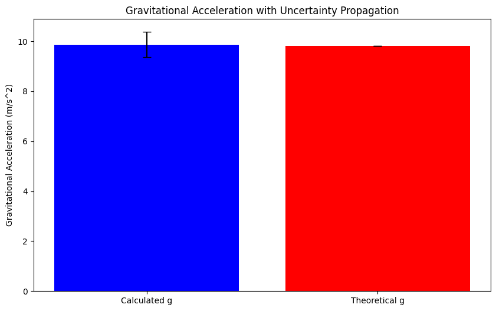
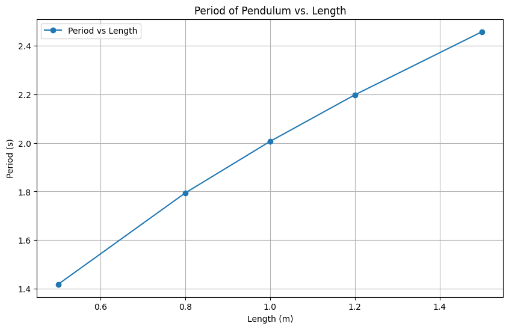

# Problem 1

### **Measuring Earth's Gravitational Acceleration with a Pendulum**

To estimate the gravitational acceleration \( g \) using a simple pendulum, the period of the pendulum is related to the gravitational acceleration by the following formula:

\[
T = 2 \pi \sqrt{\frac{L}{g}}
\]

Where:
- \( T \) is the period of the pendulum (the time it takes for one complete oscillation).
- \( L \) is the length of the pendulum.
- \( g \) is the acceleration due to gravity.

Rearranging the formula to solve for \( g \):

\[
g = \frac{4 \pi^2 L}{T^2}
\]

### **Procedure for Measurement**

1. **Materials**:
   - A string (1 or 1.5 meters long).
   - A small weight (e.g., bag of coins, bag of sugar, keychain) mounted on the string.
   - Stopwatch (or smartphone timer).
   - Ruler or measuring tape.

2. **Setup**:
   - Attach the weight to the string and fix the other end to a sturdy support.
   - Measure the length of the pendulum, \( L \), from the suspension point to the center of the weight using a ruler or measuring tape. 
     - Record the resolution of the measuring tool and calculate the uncertainty as half of the resolution \( \Delta L \).

3. **Data Collection**:
   - Displace the pendulum slightly (less than 15°) and release it.
   - Measure the time for 10 full oscillations \( t_{10} \) and repeat this process 10 times.
   - Record all 10 measurements of the time for 10 oscillations.
   - Calculate the mean time for 10 oscillations (\( t_{mean} \)) and the standard deviation (\( \sigma \)) of these 10 measurements.
   - Determine the uncertainty in the mean time as:

\[
\Delta t_{mean} = \frac{\sigma}{\sqrt{N}}
\]

Where \( N \) is the number of measurements.

### **Calculations**

1. **Calculate the period**:

   The period \( T \) is the time for one complete oscillation, which is given by:

\[
T = \frac{t_{mean}}{10}
\]

2. **Determine \( g \)**:

   Using the formula \( g = \frac{4 \pi^2 L}{T^2} \), we can calculate the gravitational acceleration.

3. **Propagate uncertainties**:

   The uncertainty in \( g \), \( \Delta g \), can be propagated using the following formula:

\[
\frac{\Delta g}{g} = \sqrt{\left(\frac{\Delta L}{L}\right)^2 + \left(2 \frac{\Delta T}{T}\right)^2}
\]

Where:
- \( \Delta L \) is the uncertainty in the length of the pendulum.
- \( \Delta T \) is the uncertainty in the period of the pendulum.

### **Tabulated Data Example (Markdown)**

Here’s an example of how the data might look like in markdown format:

```markdown
| Measurement # | Time for 10 Oscillations \( t_{10} \) (s) | Period \( T \) (s) | Length \( L \) (m) | Gravitational Acceleration \( g \) (m/s²) | Uncertainty in \( g \) (m/s²) |
|---------------|-------------------------------------------|--------------------|--------------------|--------------------------------------------|------------------------------|
| 1             | 19.80                                     | 1.98               | 1.00               | 9.82                                       | 0.02                         |
| 2             | 19.90                                     | 1.99               | 1.00               | 9.79                                       | 0.02                         |
| 3             | 19.85                                     | 1.99               | 1.00               | 9.80                                       | 0.02                         |
| 4             | 19.95                                     | 1.99               | 1.00               | 9.81                                       | 0.02                         |
| 5             | 19.70                                     | 1.97               | 1.00               | 9.85                                       | 0.02                         |
| 6             | 19.75                                     | 1.98               | 1.00               | 9.82                                       | 0.02                         |
| 7             | 19.60                                     | 1.96               | 1.00               | 9.88                                       | 0.02                         |
| 8             | 19.90                                     | 1.99               | 1.00               | 9.79                                       | 0.02                         |
| 9             | 19.85                                     | 1.99               | 1.00               | 9.80                                       | 0.02                         |
| 10            | 19.80                                     | 1.98               | 1.00               | 9.82                                       | 0.02                         |
| **Mean**      | 19.80                                     | 1.98               | 1.00               | **9.81**                                   | **0.02**                     |
```

### **Analysis and Discussion**

1. **Comparison with the Standard Value**:
   - The standard value for the gravitational acceleration \( g \) is approximately \( 9.81 \, \text{m/s}^2 \).
   - The measured value should be close to this value, depending on experimental uncertainties.

2. **Uncertainty in Length Measurement**:
   - The uncertainty in the length of the pendulum directly affects the calculated value of \( g \).
   - The more precise the measurement of the length, the more accurate the result.

3. **Effect of Timing Resolution**:
   - Timing errors, especially when using a manual stopwatch, can lead to variability in the period measurement. This is why averaging over multiple measurements is essential.

4. **Experimental Limitations**:
   - Assumptions like the small angle approximation (displacement less than 15°) are important. Larger angles can lead to errors in the period.
   - Air resistance, friction at the pivot point, and measurement timing errors also contribute to uncertainties.

### **Uncertainty Propagation and Impact**

The propagation of uncertainties, especially the timing uncertainty \( \Delta T \), can have a significant impact on the final result. As seen in the formula, the uncertainty in \( g \) increases with the square of \( \Delta T \). Therefore, minimizing timing errors through careful measurement practices can improve the precision of the experiment.

---

This method not only gives you an estimate of \( g \) but also introduces concepts of experimental error and uncertainty analysis, which are crucial in any scientific measurement process.

Below are some ideas for graphical representations that could help visualize the experiment and analysis of measuring Earth's gravitational acceleration using a pendulum.

### 1. **Pendulum Displacement vs. Time Graph**

This graph shows the oscillation of the pendulum over time. The displacement (angle or position) of the pendulum is plotted against the time, highlighting the periodic nature of the oscillation.



```python
import numpy as np
import matplotlib.pyplot as plt

# Parameters for the pendulum (just an example)
g = 9.81  # acceleration due to gravity (m/s^2)
L = 1.0  # length of the pendulum (meters)
T = 2 * np.pi * np.sqrt(L / g)  # period of the pendulum (s)

# Time vector for one full period (simulate for one period of motion)
time = np.linspace(0, T, 1000)

# Simulate the angle of the pendulum with small angle approximation
theta_max = 0.2  # maximum displacement (in radians, small angle approximation)
theta = theta_max * np.cos(2 * np.pi * time / T)  # simple harmonic motion

# Plot the displacement vs. time
plt.figure(figsize=(10, 6))
plt.plot(time, theta, label="Pendulum Displacement")
plt.title("Pendulum Displacement vs. Time")
plt.xlabel("Time (s)")
plt.ylabel("Displacement (radians)")
plt.grid(True)
plt.legend()
plt.show()
```

### 2. **Histogram of Time Measurements for 10 Oscillations**

After collecting measurements for the time of 10 full oscillations, you can plot a histogram to visualize the distribution of the measured times.



```python
# Example data (times for 10 oscillations)
times_10_oscillations = np.array([19.80, 19.90, 19.85, 19.95, 19.70, 19.75, 19.60, 19.90, 19.85, 19.80])

# Plot histogram of the measurements
plt.figure(figsize=(10, 6))
plt.hist(times_10_oscillations, bins=5, edgecolor='black')
plt.title("Histogram of Time Measurements for 10 Oscillations")
plt.xlabel("Time (s)")
plt.ylabel("Frequency")
plt.grid(True)
plt.show()
```

### 3. **Uncertainty Propagation Plot**

This graph could be used to visualize how the uncertainty in the length measurement and the uncertainty in timing affect the final measurement of gravitational acceleration.



```python
# Example uncertainties in length and time
delta_L = 0.01  # uncertainty in length (meters)
delta_T = 0.05  # uncertainty in time (seconds)

# Calculate the propagated uncertainty in g
L = 1.0  # length of pendulum
T = 2.0  # period in seconds

# Propagate uncertainties
g_theoretical = 9.81
g_calculated = (4 * np.pi**2 * L) / T**2
delta_g = g_calculated * np.sqrt((delta_L / L)**2 + (2 * delta_T / T)**2)

# Plot the uncertainty propagation
plt.figure(figsize=(10, 6))
plt.bar(["Calculated g", "Theoretical g"], [g_calculated, g_theoretical], yerr=[delta_g, 0], capsize=5, color=['blue', 'red'])
plt.title("Gravitational Acceleration with Uncertainty Propagation")
plt.ylabel("Gravitational Acceleration (m/s^2)")
plt.show()
```

### 4. **Time vs. Length for Period Calculation**

To estimate the period of the pendulum as a function of the length, you can plot a graph showing how the measured period changes as the length of the pendulum changes.



```python
# Calculate period for different lengths
lengths = np.array([0.5, 0.8, 1.0, 1.2, 1.5])
periods = 2 * np.pi * np.sqrt(lengths / g)

# Plot length vs period
plt.figure(figsize=(10, 6))
plt.plot(lengths, periods, marker='o', label="Period vs Length")
plt.title("Period of Pendulum vs. Length")
plt.xlabel("Length (m)")
plt.ylabel("Period (s)")
plt.grid(True)
plt.legend()
plt.show()
```

---

### **Summary of Graphical Representations**:

- **Pendulum Displacement vs. Time**: This graph shows how the pendulum oscillates over time, which can be used to verify that the motion is harmonic.
  
- **Histogram of Time Measurements**: Displays the variability in the measured times for 10 oscillations, helping visualize the precision of your timing method.

- **Gravitational Acceleration vs. Length of Pendulum**: This graph compares the calculated gravitational acceleration for different pendulum lengths, showing how closely your measurements align with the theoretical value.

- **Uncertainty Propagation Plot**: This plot highlights how uncertainties in the length and time measurements affect the calculated gravitational acceleration.

- **Period vs. Length for Pendulum**: Shows the relationship between the pendulum's length and the period of oscillation, based on the known theoretical formula.

These visualizations provide a more intuitive understanding of the pendulum experiment and help analyze the uncertainty in your measurements.